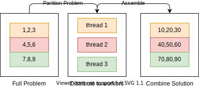
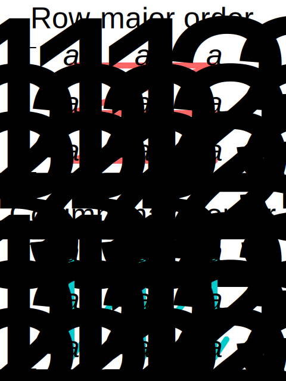

# 270191U025-Software-Architecture-assignment-7

During this exercise, we take a look at how concurrency can be used to parallelize parts of an algorithm.
Specifically, we examine how algorithms operating on matrices of data can be distributed across multiple threads. So for this you will need to remember some principles from Numerical Linear Algebra as well. You will perform matrix scalar multiplication in two different ways.

# Exercise

1. Examine the test case defined in `test_matrix.cpp` and compare it with the definition found in `matrix.hpp`.
2. Implement the `multiply_single_threaded` method in `matrix.hpp`. This should multiply all entries in the matrix by the specified constant. Re-run the test to verify that the first test case is passing.
3. Implement the static helper method `multiply_slice` in `matrix.hpp`. This function will be executed by each thread to perform the actual multiplication on a specific sub-section (slice) of the matrix.
4. Implement the `multiply_partitioned` method in `matrix.hpp`. This should split the matrix into **n** parts and spawn a separate thread for each part, utilizing the `multiply_slice` method you just completed. Re-run the test to verify that all test cases pass.
   - **Hint:** Determine whether or not you need to use a mutex to ensure mutual exclusion. Why or why not?
# Assignment-7
